# 🧐 Prescripto – AI-Powered Dynamic Appointment Scheduler

## 🚀 Overview

**Prescripto** is an intelligent hospital management platform that leverages **Artificial Intelligence (AI)** and **Machine Learning (ML)** to redefine healthcare efficiency and accessibility. It allows:

- 🧠 **Disease prediction** based on user-entered symptoms  
- 🩺 **Specialist recommendation** for accurate diagnosis and treatment  
- ⚠️ **Severity level classification** to prioritize critical cases  
- 📅 **Dynamic, conflict-free appointment scheduling** based on doctor availability  
- 🚨 **Emergency slot allocation** for urgent situations  

Role-based access is integrated for **Patients**, **Doctors**, and **Admins**, ensuring a tailored and secure experience for each stakeholder.

---

## 📌 Core Features

### 👤 Patient Features

- ✨ **AI-Powered Symptom-Based Disease Prediction**  
  Input symptoms and receive a probable diagnosis using ML models.

- 🔎 **Smart Doctor Recommendations**  
  Get matched with the right specialist for your condition.

- ⚡ **Severity-Based Classification**
  - 🔴 Emergency  
  - 🔷 High  
  - 🔶 Moderate  
  - 🔵 Low  

- 📅 **Dynamic Appointment Booking**  
  - ⚠️ Emergency? Get an immediate slot  
  - 🗓️ Non-emergency? Schedule based on doctor availability  

- ❌ **Conflict-Free Slot Management**  
  Eliminates overlapping by hiding already booked slots.

- 📖 **Find Doctors by Specialty**  
  Easily search and filter doctors by their medical field.

---

### 🩺 Doctor Features

- 🔢 **View Recent Appointments**  
  Check your 5 latest patient bookings instantly.

- ✏️ **Manage Appointments**  
  Confirm, reschedule, or cancel appointments as needed.

- ⏰ **Availability Scheduling**  
  Set and update your available consultation slots.

---

### 🛡️ Admin Features

- 📊 **Global Appointment Control**  
  View and manage appointments across the hospital.

- 📕 **Recent Appointments Overview**  
  Monitor the latest hospital-wide patient bookings.

- ⚙️ **Doctor Slot Management**  
  Modify or manage doctor availability.

- ➕ **Register New Doctors**  
  Seamlessly add and onboard new medical professionals.

---

## 🛠️ Tech Stack

### 🌐 Frontend

- ⚛️ **React.js** – Fast and dynamic user interfaces  
- 🎨 **Tailwind CSS / Material UI** – Responsive and modern styling  
- 🔄 **Axios / Fetch API** – Smooth client-server communication  

### 🧠 AI & Machine Learning

- 🐍 **Python** – ML backend  
- 📦 **Scikit-learn, NumPy, Pandas** – Data processing & training  
- 🌐 **Flask** – REST API to connect ML with frontend/backend  

### 💻 Backend

- 🟢 **Node.js + Express.js** – RESTful API services and business logic  

### 🗄️ Database

- 🍃 **MongoDB** – NoSQL database for users, doctors, appointments, and more  

---

## 🌍 Live Demo

Experience Prescripto in real-time!  
Click the links below to explore different interfaces:

🔗 **User Portal**  
👉 [Launch User Dashboard](http://ec2-13-60-60-176.eu-north-1.compute.amazonaws.com/)

🔗 **Admin Panel**  
👉 [Launch Admin Panel](http://ec2-13-60-60-176.eu-north-1.compute.amazonaws.com/admin/index.html)

---

## 🖼️ Screenshots

### 👥 User Interface

#### 🔐 User Login

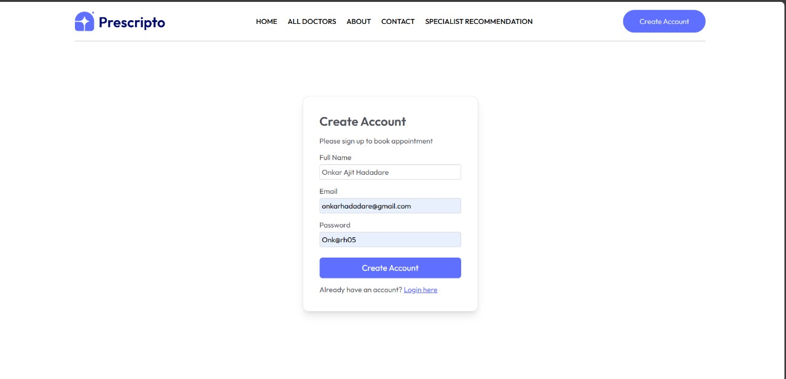

#### 🏠 Home Page

#### 🔍 Find by Specialty

#### 📖 Create Account
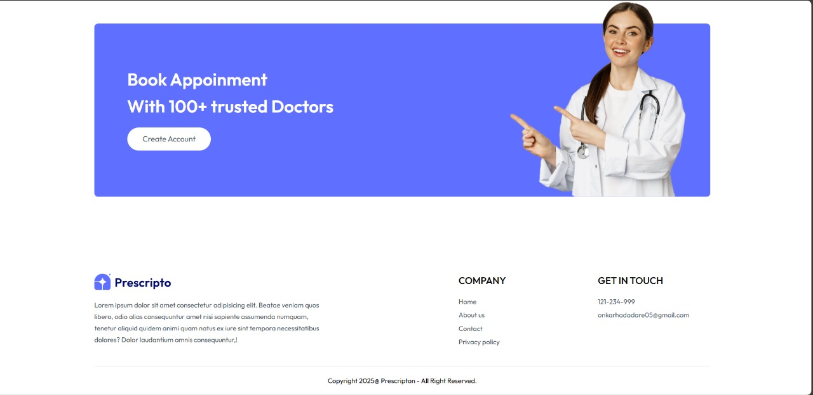

#### 👨‍⚕️ All Doctors View

#### 🔍 Related Doctor View

#### 📅 Appointment Booking
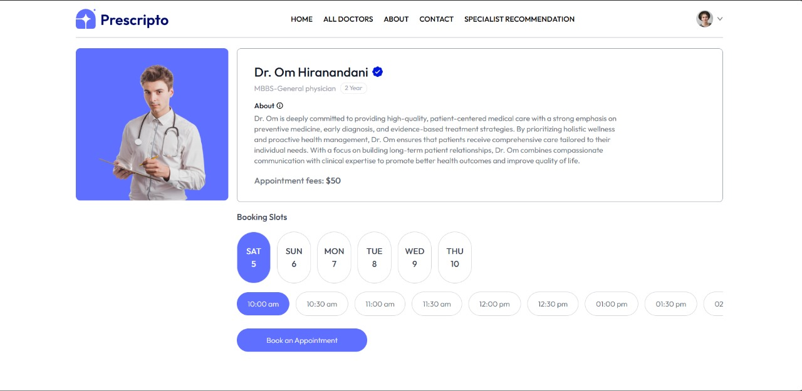

#### 📋 My Appointments

#### 💳 Payment Page
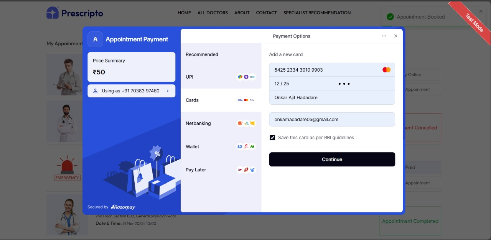

#### 🔹 Speciality Recommendations
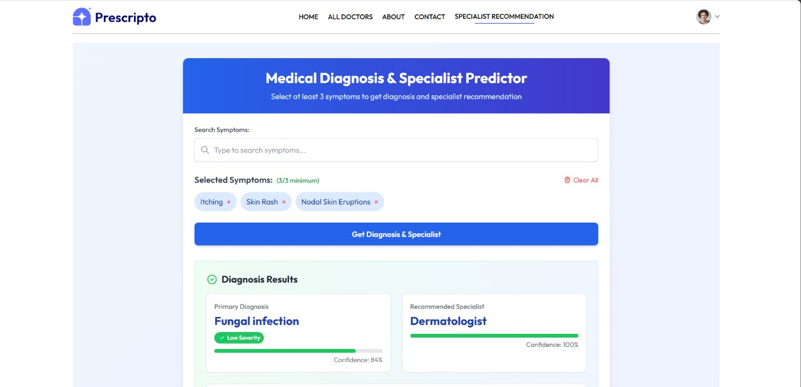
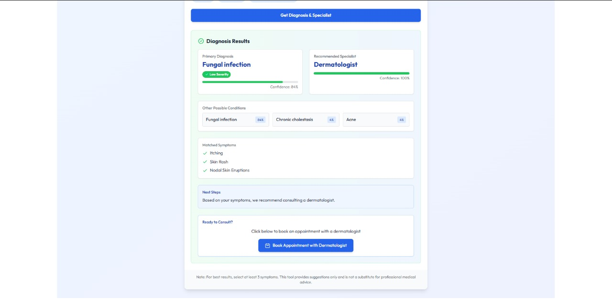

#### ⚡ Emergency Slot Allocation
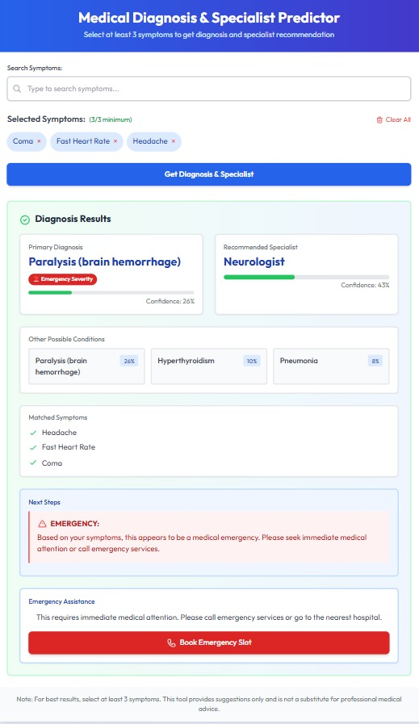

#### 📅 Emergency Slot Booking

#### 🌟 User Profile

#### 📄 About Page

#### 💬 Contact Page
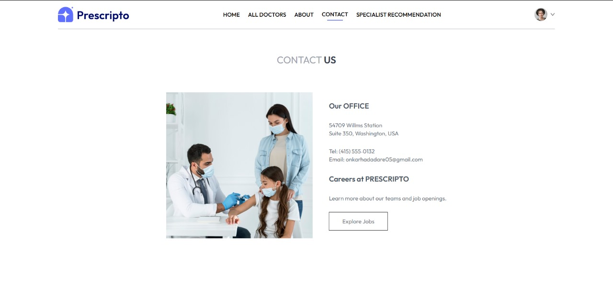

### 📆 Admin Interface

#### 🔐 Admin Login

#### 📊 Dashboard & Latest Appointments

#### 📅 All Appointments View

#### ➕ Add Doctor
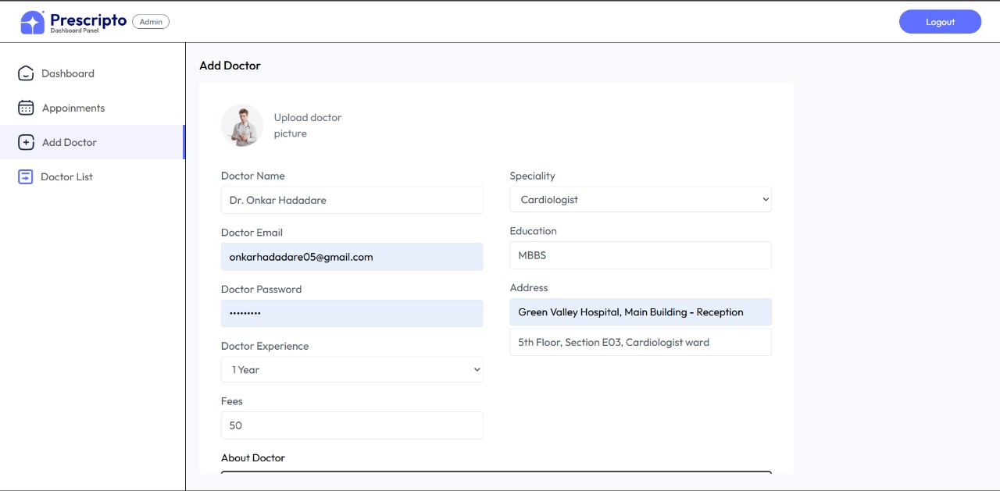

#### ⏰ Doctor Availability Management
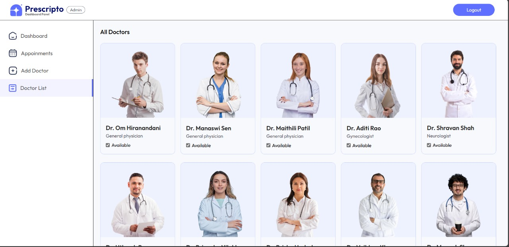

#### 👩‍⚕️ Doctor Interface

### 🔐 Doctor Login

#### 📊 Doctor Dashboard
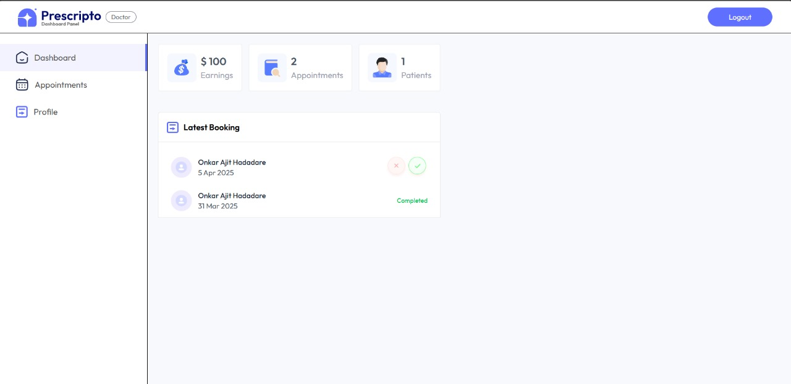

#### 📅 Doctor Appointments View
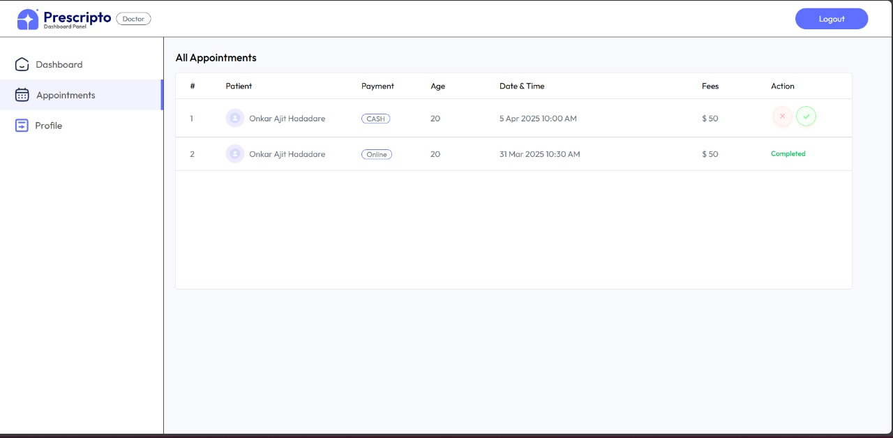

#### 👨‍⚕️ Doctor Profile & Availability

<!-- update 6195 -->

<!-- update 9869 -->

<!-- update 5250 -->

<!-- update 5836 -->

<!-- update 7350 -->

<!-- update 9418 -->

<!-- update 9800 -->

<!-- update 8755 -->
